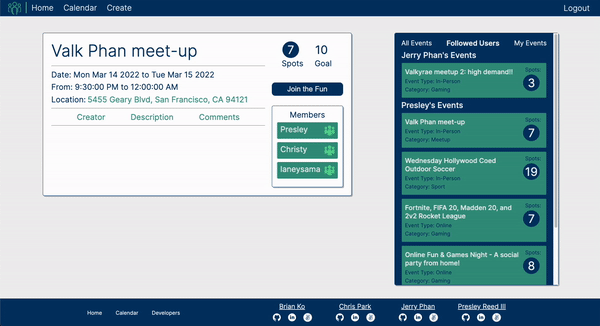
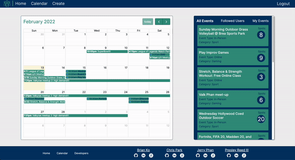
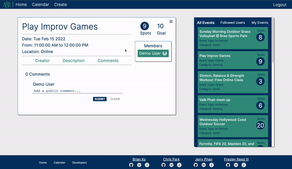
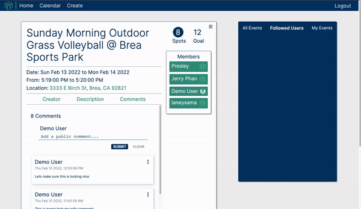

# **LFG**

## **Creators**
- Brian Ko
- Chris Park
- Jerry Phan
- Presley Reed III

## **Technologies Used**

- Frontend: React, Redux, HTML, CSS
- Backend: Mongo, Express, Node.js
- Storage: Amazon S3
- Production: Heroku
- API: FullCalendar.io

## **Key Features**

### **Calendar**

- FullCalendar calendar visual is added to enhance the user experience and UI with dynamically posted events and filtering.


```javascript
formatEvents(events) {
    const newEvents = [];
    events.forEach((event) => {
      let eventObj = {
        title: event.title,
        start: event.eventStart,
        end: event.eventEnd,
        url: `/#/events/${event._id}`,
      }
      newEvents.push(eventObj)
    })
    return newEvents
  }

  render() {
    const events = this.formatEvents(this.props.events)

    return (
      <div id="calendar">
        <FullCalendar
          plugins={[dayGridPlugin, interactionPlugin]}
          dateClick={this.handleDateClick}
          events={events}
          eventTimeFormat={{hour: 'numeric',
            minute: '2-digit',
            meridiem: 'short'}}
        />
      </div>
    );
  }

```

### **Filtering**

- Users can filter events by clicking the different selection tabs on the Events List.
- Following other users will also dynamically update the filtered Event List.



### **Listing/Postings**

- Users can create listings for other users to join
- Listings can be modified or deleted by the creator
- Listings will update dynamically with current availability 

```javascript

  handleCategory(e) {
    let selected = Array.from(document.getElementsByClassName('category-selector'))
    selected.forEach((input) => {
      if (input.selected) this.setState({category: e.currentTarget.value})
    })
  }

  handleEventType(e) {
    let selected = Array.from(document.getElementsByClassName('eventType-selector'))
    selected.forEach((input) => {
      if (input.selected) this.setState({eventType: e.currentTarget.value})
    })
  }

  renderErrors() {
    return (
      <ul id="errors-container">
        {Object.keys(this.state.errors).map((error, i) => (
          <li id="modal-errors" key={`error-${i}`}>{this.state.errors[error]}</li>
        ))}
      </ul>
    );
  }

```



### **User Auth**

- Users can login and create an account
- Demo functionality available
- Users that are not logged in will be redirected to the login page when attempting to view event details 


### **Comments**

- Logged in users can leave comments on event page
- Existing comments can be modified or deleted by the creator



```javascript

  editComment(){
    let comment = document.querySelectorAll(`.comment-index-item-text`);
    comment.forEach((option) => {
      if (option.classList.contains(this.props.index)) {
        option.classList.toggle("hide");
      }
    });

    let editComment = document.querySelectorAll(`.comment-edit-hide`);
    editComment.forEach((option) => {
      if (option.classList.contains(this.props.index)) {
        option.classList.toggle("active-flex");
      }
    });

    this.setActive()
  }

  setActive(){
    let dropdown = document.querySelectorAll(`.comment-dropdown-content`);
    dropdown.forEach((option) => {
      if (option.classList.contains(this.props.index)) {
        option.classList.toggle('active')
      }
    })
  }

```

### **Follows**

- Can follow a user and see following change dynamically
- Logged in users can view their followed users events when filtered



## Design and Color Scheme

- Font: Inter 
``` html 
	<link rel="preconnect" href="https://fonts.googleapis.com"> 
	<link rel="preconnect" href="https://fonts.gstatic.com" crossorigin> 
	<link href="https://fonts.googleapis.com/css2?family=Inter:wght@100;200;300;400;500;600;700;800;900&display=swap" rel="stylesheet">
```