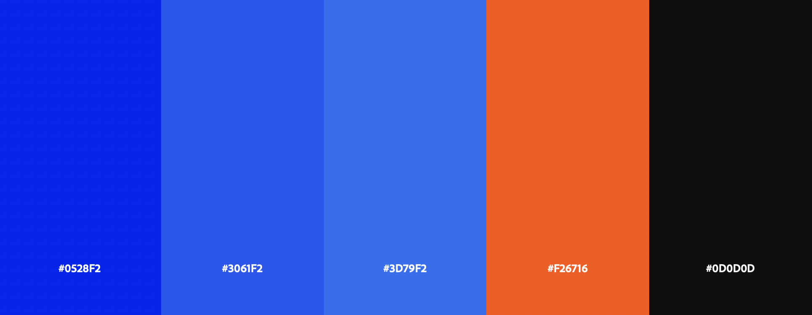
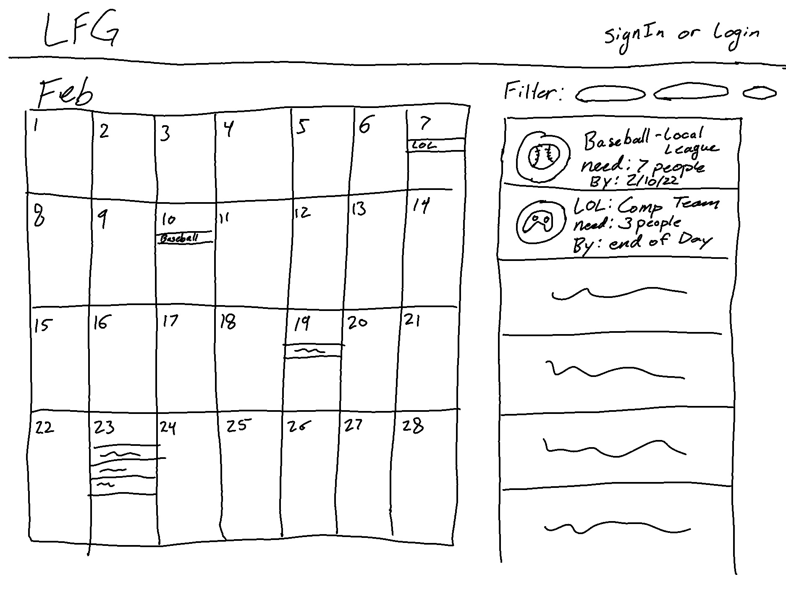
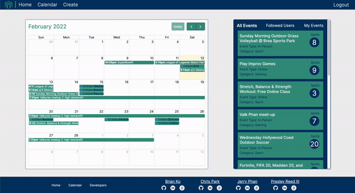

# **LFG**
### Creators
- Brian Ko
- Chris Park
- Jerry Phan
- Presley Reed III

## **Technologies Used**

- Frontend: React, Redux, HTML, CSS
- Backend: Mongo, Express, Node.js
- Storage: Amazon S3
- Production: Heroku
- API: FullCalendar.io

## Design and Color Scheme

- Font: Inter 
``` html 
	<link rel="preconnect" href="https://fonts.googleapis.com"> 
	<link rel="preconnect" href="https://fonts.gstatic.com" crossorigin> 
	<link href="https://fonts.googleapis.com/css2?family=Inter:wght@100;200;300;400;500;600;700;800;900&display=swap" rel="stylesheet">
```
- Wireframe


## **Key Features**

### **Calendar**

- FullCalendar calendar visual is added to enhance the user experience and UI with dynamically posted events and filtering.



```javascript
formatEvents(events) {
    const newEvents = [];
    events.forEach((event) => {
      let eventObj = {
        title: event.title,
        start: event.eventStart,
        end: event.eventEnd,
        url: `/#/events/${event._id}`,
      }
      newEvents.push(eventObj)
    })
    return newEvents
  }

  render() {
    const events = this.formatEvents(this.props.events)

    return (
      <div id="calendar">
        <FullCalendar
          plugins={[dayGridPlugin, interactionPlugin]}
          dateClick={this.handleDateClick}
          events={events}
          eventTimeFormat={{hour: 'numeric',
            minute: '2-digit',
            meridiem: 'short'}}
        />
      </div>
    );
  }

```
